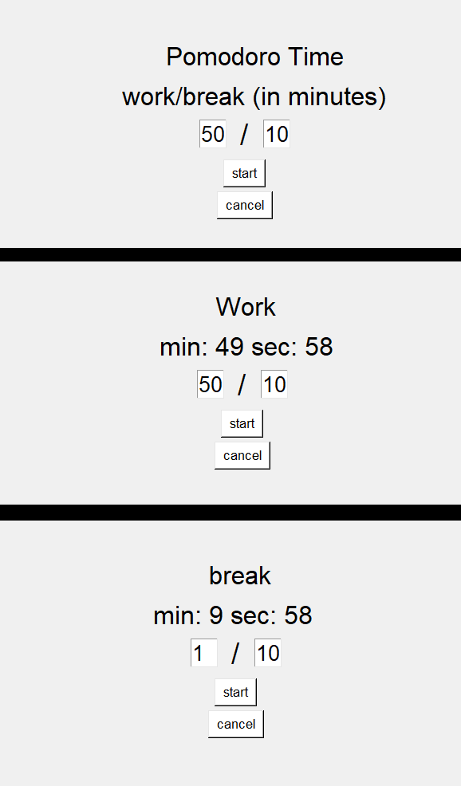

# Pomodoro-App
Basic pomodoro app made with tkinter

# CONS
No sound effect

While dragging the window, window freezes and countdown stops (might be solved using threading/multiprocessing (I am not sure though)) 

Almost every widget is located according to the base window size (600x400). Changing the width or/and height will make widgets appear at unexpected locations.

